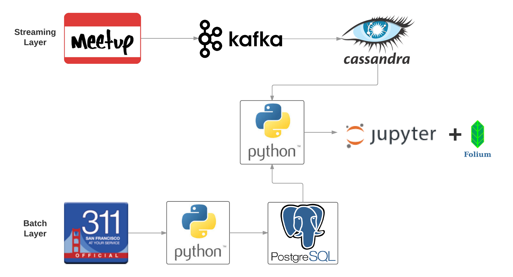
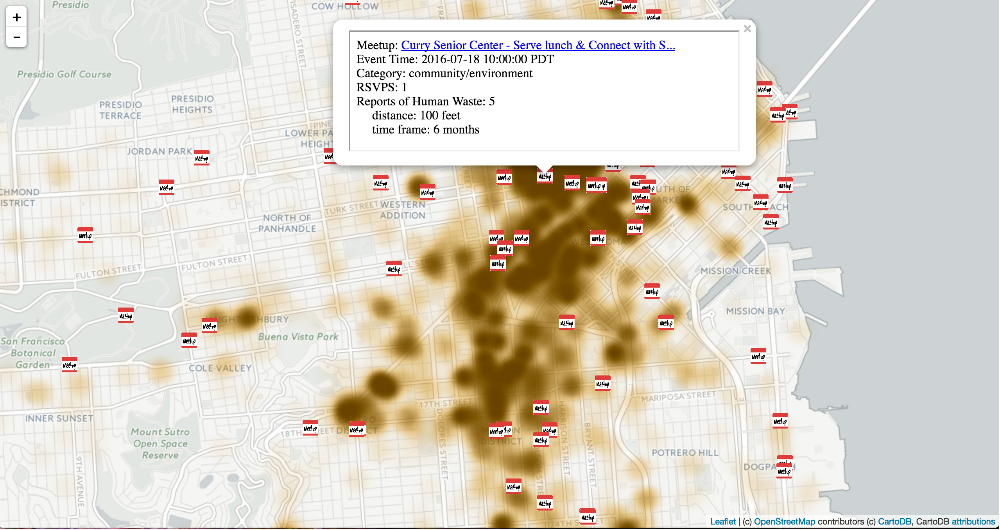

# Crappy Meetup
* Realtime mapping of Meetup locations alongside historical reports of human waste in San Francisco
* Data Engineering Project for [Galvanize's MS in Data Science Program](http://www.galvanizeu.com/about)

## The Problem

According to the [2015 Annual Homless Assesment Report](https://www.hudexchange.info/resources/documents/2015-AHAR-Part-1.pdf) from [HUD](http://portal.hud.gov/hudportal/HUD):

>* In January 2015, 564,708 people were
homeless people on a given night. 
>* In San Francisco there are an estimated 6,675 homeless persons
>* 64.3% of San Francisco's homeless persons are unsheltered (that's roughly 4,292 persons)
>* Unsheltered Homeless People are people who
stay in places not meant for human habitation,
such as the streets, abandoned buildings,
vehicles, or parks.

Unsheltered homeless persons don't have reliable access to bathroom facilities. Where are they supposed to go?

In 2014, there were 10,520 instances of human waste reported to 311 for cleanup from streets and sidewalks. In 2015 that number grew to 13,148. That's an increase of 25%!

This map allows both the groups hosting the Meetup and the Meetup attendee to check out the neighborhood to see if the Meetup is in a "crappy" area.

## The Data

I used streaming data from [Meetup](http://www.Meetup.com/Meetup_api/docs/stream/2/open_events/) and combined that with San Fransisco's 311* data which I obtained through [SF OpenData](https://data.sfgov.org/City-Infrastructure/Case-Data-from-San-Francisco-311-SF311-/tyzs-6f38). 

## The Architecture

## The Map

[Interactive Map](https://dl.dropboxusercontent.com/u/1355087/crappy_Meetup.html)

## The Future

<ul>
<li><input type="checkbox" disabled> Migrate to Cassandra 3</li>
<li><input type="checkbox" disabled> Migrate to EC2 & S3</li>
<li><input type="checkbox" disabled> Write a chron job to do a nightly pull on the 311 data, upsert into table, and split Lat/Lon Point into 2 columns</li>
<li><input type="checkbox" disabled> Write chron job to delete old rows from Cassandra</li>
<li><input type="checkbox" disabled> Create Kafka topics for Meetup categories</li>
<li><input type="checkbox" disabled> Migrate to Hadoop or Spark for aggregation currently being processed in a python script</li>
<li><input type="checkbox" disabled> Get this up on an actual website</li>
</ul>

## Hmm, the Architecture is Missing Something...

 
 
 
 
 
*3-1-1 is who the public can contact with non-emergency City and County of San Francisco government matters.
